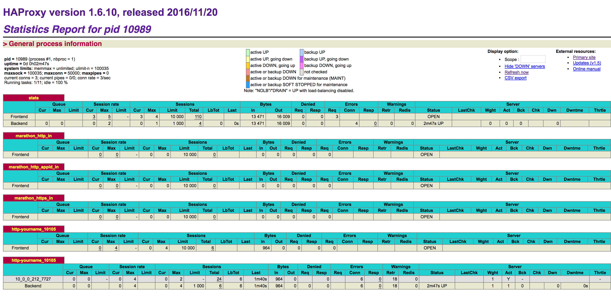

## Debug common issues

**Exercise 1 - Horizontal Scaling App - Not enough resources**

1. Deploy an application and scale the instances
    ```
    dcos marathon app update /app-scaling instances=100
    dcos marathon app list
    dcos marathon deployment list
    ```

2. Look into the Marathon logs. Can you find the reason why the deployment is in waiting state?
    ```
    dcos node ssh --master-proxy --leader
    sudo journalctl -flu dcos-marathon | grep app-scaling
    ```

3. Reset the deployment by forcing the instances to be 1
    ```
    dcos marathon app update /app-scaling --force instances=1
    ```

**Exercise 2 - Vertical scaling - No matching resources**

1. Now increase the CPU allocation of the app
    ```
    dcos marathon app update /app-scaling cpus=100
    dcos marathon app list
    dcos marathon deployment list
    ```

2. Look into the Marathon logs. Can you find the reason why the deployment is in waiting state?
    ```
    dcos node ssh --master-proxy --leader
    sudo journalctl -flu dcos-marathon | grep app-scaling
    ```

3. Reset the deployment by forcing the cpu allocation to be 1
    ```
    dcos marathon app update /app-scaling --force cpus=1
    ```

**Exercise 3 - OOM Situations**

1. Deploy the file `app-oom.json`
    ```
    dcos marathon app add app-oom.json
    ```

2. Look into the Marathon logs. Can you find the reason why the application is failing?
    ```
    dcos node ssh --master-proxy --leader
    sudo journalctl -flu dcos-marathon | grep app-oom
    ```

3. Login to one of the agents the task failed on. You can see in the journal that the process got killed because of the cgroup memory violation.
    ```
    dcos node ssh --master-proxy --mesos-id=$(dcos task app-oom --json | jq -r '.[] | .slave_id')
    journalctl -f _TRANSPORT=kernel
    ```

4. Remove the application
    ```
    dcos marathon app remove /app-oom
    ```

**Exercise 4 - Docker Images**

1. Deploy the file `dockerimage.json`
    ```
    dcos marathon app add dockerimage.json
    ```

    The app will fail over and over again without any logs.

2. Can you find the reason why the application is failing?
     ```
     docker pull noimage:idonotexist
     ```

**Exercise 5 - Debugging Web Applications**

Prerequisite:

    * [marathon-lb](https://dcos.io/docs/1.8/usage/service-discovery/marathon-lb/) installed on all public nodes
    * [IP of your public agent](https://dcos.io/docs/1.8/administration/locate-public-agent/)
    * [Dcos CLI](https://dcos.io/docs/1.8/usage/cli/#docs-article) installed


We want to deploy webserver listening on port 3030, and even set the service port so we can reach it via marathon-lb.

1. Deploy the file `webserver1.json`
    ```
    dcos marathon app add webserver1.json
    ```
2. Try to reach it via marathon-lb

    We try to go to http://<public_agent>:10105/ in our browser, but the webapp doesn not show up. So we let us try to figure out why this is not working.

3. Check marathon-lb/HAProxy
    In order to see if/how marathon-lb has picked up the app, we look at it the HAProxy stats.  These are available on all nodes where marathon-lb is installed: http://<public_ip>:9090/haproxy?stats

    a. The page should look similar to the screenshot below. So we can see that marathon-lb has picked up the app. And 10.0.0.212:7727 is used as backend for the service port frontend 10105.

    

4. Check whether we can reach that backend from within the cluster
    ```
    dcos node ssh --leader --master-proxy
    curl 10.0.0.212:7727
    ```
    We should see something similar to:
   `curl: (7) Failed to connect to 10.0.0.212 port 7727: Connection refused`

    So seemingly the app isn't serving on 10.0.0.212:7727, which is the address used by marathon-lb.

5. Check on which port our app ist listening

    Let us revisit our application definition:
    ```
    "cmd": "echo 'Hello DC/OS' > index.html && python -m http.server 3030"
    ```
    So let us check whether we can reach our application on port 3030

    ```
    dcos node ssh --leader --master-proxy
    curl 10.0.0.212:3030
    Hello DC/OS
    ```

    So we have identified the problem: Marathon-lb tries to redirect to the random assigned port 7727, while our app is listening on port 3030. Note that, port 3030 is not allocated (as it is not in the app specification), so it might actually happen that another app is already using that port. Also that implies we can only run a single instance per node.

6. Fixing the problem
    We have two options for fixing this problem

    a) Have the application listen to the random port
        DC/OS will give you the PORT0 environment variable holding the first random port assigned to your app. So we could change out webserver to listen to that port:
        ```
        "cmd": "echo 'Hello DC/OS' > index.html && python -m http.server PORT0"
        ```

    b) Sometimes using a random port is not possible, as the application needs to listen to a fixed port (e.g., 3030). In that case we can run our docker container in bridge mode (see here for details on host versus bridge mode). That would mean inside the container network the application can use port 3030, which is mapped to a random port on the host.


    See webserver2.json for more details.


